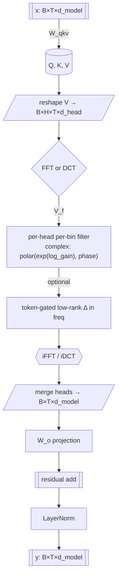

# Spectral Attention

Frequency-domain global mixing for sequence models. This repository implements a practical Spectral Attention block that mixes tokens via rFFT/DCT filters in O(n log n) time with low memory, along with tiny encoder stacks, training/eval scripts, benchmarks, and analysis notebooks.

Think of it as a drop-in alternative to vanilla self-attention for long contexts: instead of quadratic O(n²) dot-products, we learn per-frequency filters and transform back to the time domain.


## Highlights

- O(n log n) mixing along the sequence dimension via FFT/DCT
- Per-head, per-bin learnable filters: magnitude (log_gain) and phase
- Optional token-conditioned gate that modulates frequencies
- **FlashAttention integration** for efficient QK^T softmax computation when available
- **Holonomy Attention** support for curvature-inspired rotations
- Works with PyTorch autocast/mixed precision, torch.compile
- Minimal encoder blocks and LM wrappers for quick experiments
- Benchmarks, metrics.jsonl logging, and analysis notebooks included


## Repository layout

- `src/spectral_attention/`
	- `spectral_attention.py`: Core SpectralAttention module (rFFT/DCT paths, FlashAttention integration)
	- `holonomy.py`: HolonomyAttention module with curvature-inspired rotations
	- `blocks.py`: Encoder block/stack + minimal LM wrapper
	- `vanilla_blocks.py`: Baseline Transformer encoder (nn.MultiheadAttention)
	- `models.py`: SpectralLM/VanillaLM (token + positional embeddings + encoder + head)
	- `train_eval.py`: Utility functions for tiny training/eval + throughput
	- `metrics.py`, `utils.py`: Perf helpers (tokens/s, peak MB) and device helpers
- `scripts/`
	- `bench_spectral_attention.py`: Micro-benchmark tokens/s vs config
	- `bench_flashspectra.py`: **FlashAttention vs standard SpectralAttention benchmark**
	- `train_lm.py`: Train spectral/vanilla LM on Wikitext-2 (Hugging Face datasets)
	- `compare.py`: Small comparison suites (LM and IMDB byte-level)
	- `plot_freq_response.py`: Plot mean gain/phase from a checkpoint
- `experiments/`
	- `configs/`: Example YAML configs for benchmarks
	- `runs/`, `runs/compare/`: Metrics logs (metrics.jsonl), checkpoints, artifacts
	- `promote/`: Curated results to move into docs
- `notebooks/`: Quickstart, frequency response, long-context eval, benchmark report
	- `05_multilang_compare.ipynb`: Multilingual GPT-2 vs Spectral GPT-2 demo (EN/HI/GU/KN)
- `tests/`: Unit tests for shapes/grad/AMP/bins and encoder smoke tests


## How it works (architecture)

Inside `src/spectral_attention/spectral_attention.py`:

- Projections: input x ∈ R[B, T, d_model] → project to Q, K, V; we mix V across the sequence
- Reshape V → [B, H, T, d_head]
- Transform across the sequence (dim=T):
	- rFFT path (default): V_f = rFFT(V)
		- Learn per-head complex filter: magnitude = exp(log_gain[H, Fr]), phase[H, Fr]
		- Apply: V_f ← V_f ⊙ polar(magnitude, phase)
		- Optional token_gate: rank-1 additive term in frequency from a gated token signal
		- Inverse: y_h = irFFT(V_f)
	- DCT path (`--use_dct`): V_t = DCT-II(V), multiply by gain, optional gate, then IDCT-III
- Merge heads → output projection → residual add with input

Key properties:

- Complexity: O(n log n) per layer along sequence length T (n = T)
- Memory: linear in T; avoids O(T²) attention maps
- Per-seq-length bin parameters are lazily initialized on the first forward pass, then updated if T changes
- Robust to missing torch.fft.dct: falls back to a safe DCT-II/IDCT-III implemented via rFFT
- **FlashAttention integration**: When `use_flash=True`, combines efficient QK^T computation with spectral mixing
- **Holonomy rotations**: Alternative attention mechanism using learnable curvature-inspired transformations

## FlashAttention Integration

SpectralAttention supports optional FlashAttention integration via the `use_flash=True` parameter:

```python
from spectral_attention import SpectralAttention

# Standard spectral mixing
attn_standard = SpectralAttention(d_model=512, n_heads=8, use_flash=False)

# With FlashAttention for efficient QK^T computation  
attn_flash = SpectralAttention(d_model=512, n_heads=8, use_flash=True)
```

**Benefits:**
- Reduced memory footprint for long sequences 
- Faster QK^T softmax computation
- Graceful fallback to standard spectral mixing if FlashAttention unavailable
- Compatible with both rFFT and DCT spectral transforms

**Memory efficiency benchmark:**
```bash
python scripts/bench_flashspectra.py --seq 4096 8192 --batch 2 --logdir experiments/flash_benchmark
```

## Holonomy Attention

The repository also includes `HolonomyAttention`, an alternative attention mechanism that applies learnable curvature-inspired rotations to queries before standard scaled dot-product attention:

```python
from spectral_attention.holonomy import HolonomyAttention

# Create holonomy attention layer
holonomy_attn = HolonomyAttention(d_head=64, n_heads=8, dropout=0.1)

# Use with Q, K, V tensors [batch, heads, seq_len, dim]
output = holonomy_attn(Q, K, V, mask=causal_mask)
```

**Key features:**
- Learnable curvature matrix per head for query rotation
- Standard scaled dot-product attention after rotation
- Optional causal masking support  
- Dropout regularization

## Related research (context & contrasts)

* FNet (Fourier Transform Is All You Need, 2021) – replaces attention with a fixed 2D Fourier transform over tokens and channels. No learned per-frequency parameters; primarily encoder-only.
	Contrast: our mixer learns per-head, per-bin filters (gain + phase) and supports DCT; FNet’s transform is fixed and phase-uncontrolled.

* Fourier Neural Operator (FNO) – solves PDEs with FFT → learned complex multipliers → iFFT.
	Contrast: close mathematically (learned spectral weights), but targeted at continuous operators; we implement a drop-in Transformer block for NLP/sequence modeling with token-wise projections, residuals, and LM wrappers.

* Hyena Hierarchy – long-convolution sequence models using frequency-domain tricks for fast kernels.
	Contrast: Hyena uses implicit long convolutions; our module is an explicit spectral filter replacing self-attention, with interpretable per-frequency responses.

* S4 / state-space models – long-sequence models with diagonal-plus-low-rank structure; FFT used for efficient training/inference.
	Contrast: very different parameterization (state-space vs attention replacement). We keep the Transformer ergonomics and API.

* Efficient/linear attentions (Performer, Linear, Longformer, etc.) – kernel or sparsity tricks to tame O(n²).
	Contrast: we reduce mixing to O(n log n) via FFT/DCT, expose direct frequency-response parameters, and retain global context.

Takeaway: prior work uses Fourier methods or efficiency tricks, but (to our knowledge) none provide a learned per-head, per-bin complex filter (gain+phase), Hermitian-tied for real outputs, with an optional token-gated low-rank delta, as a drop-in attention substitute benchmarked end-to-end on long contexts.

## What’s novel in this repo

1) Per-head, per-bin learnable complex filters
	 - Parameters: `log_gain[h, f]` and `phase[h, f]` → interpretable magnitude/phase.
	 - Hermitian tying guarantees real inverse transforms.

2) Optional token-gated low-rank delta
	 - A lightweight, token-conditioned additive term in frequency space that sharpens locality without giving up global mixing.

3) Dual backends (rFFT / DCT)
	 - rFFT yields gain and phase control; DCT provides a real-valued alternative.

4) Lazy bin sizing & stability
	 - Frequency bins are lazily initialized at first forward for the current sequence length; supports dynamic T with tests.

5) Drop-in block + full LM wrappers
	 - `SpectralAttention` drops into encoder stacks; `SpectralEncoderModel` mirrors vanilla LM for apples-to-apples training, eval, and throughput.

6) Interpretable diagnostics
	 - Notebook + script to plot learned frequency response over training; frequency-aware regularization hooks are trivial to add.

7) Scaling results
	 - At T = 4096, spectral runs at ~2.4× the tokens/s of vanilla in our setup while matching perplexity after short training (see Benchmarks).

## Architecture (diagram)

Mermaid (renders on GitHub)



ASCII fallback

```
x --W_qkv--> (Q,K,V) --reshape--> V[B,H,T,dh]
			|                         |
			|                    FFT/DCT over T
			|                         v
			|                     V_f * H[f]    (H is complex: exp(log_gain) · e^{i·phase})
			|                         + Δ_token (optional low-rank gate in freq)
			|                         v
			|                       iFFT/iDCT
			'---- residual + W_o + LayerNorm ----> y
```

Complexity: O(T log T) per layer along the sequence (vs O(T²) attention maps). Memory: linear in T; no dense attention matrices.

## Reproducible comparisons

- Vanilla vs Spectral (LM @ 4k)
	Use `scripts/train_lm.py` (bf16 + torch.compile recommended) to train both models with the same hyper-params and tokenizer. Measure throughput and memory; evaluate perplexity on val/test.
- Third-party baseline (Hugging Face)
	`scripts/speed_eval_external.py` times `gpt2`/`gpt2-medium` forwards under the same `(batch, seq, dtype)` and optionally reports validation perplexity.
- Frequency response snapshots
	`scripts/plot_freq_response.py --ckpt <path>` saves gain/phase plots over rFFT bins so you can correlate spectral shape with downstream quality.

Prereqs: Python 3.10+, PyTorch 2.x. Optional: CUDA GPU for speed.

Option A: pip install (local)

```powershell
pip install -e .

Option B: use the provided environment files

# Or pip-only extras
pip install -r requirements.txt
```

Notes:
- Training scripts use `datasets` and `transformers` (installed via env/conda or requirements)
- For GPU, ensure a CUDA-enabled PyTorch build


## Quickstart (API)

Create and run a SpectralAttention block:

```python
import torch
from spectral_attention import SpectralAttention

x = torch.randn(2, 1024, 512)   # [B, T, d_model]
m = SpectralAttention(d_model=512, n_heads=8, use_dct=False)
y = m(x)
print(y.shape)  # -> (2, 1024, 512)
```

Encoder stack + logits:

```python
import torch
from spectral_attention import SpectralEncoderModel

ids = torch.randint(0, 1000, (2, 256))  # toy tokens
model = SpectralEncoderModel(vocab_size=1000, d_model=256, n_heads=8, depth=2)
logits = model(ids)
print(logits.shape)  # -> (2, 256, 1000)
```


## Benchmarks and training

Micro-benchmark the block (tokens/s):

```powershell
python scripts/bench_spectral_attention.py --batch 4 --seq 4096 --dmodel 512 --heads 8 --device auto --iters 50 --warmup 10 --compile
```

Train a small LM on Wikitext-2 (byte/word tokenizer via HF):

```powershell
# spectral LM
python scripts/train_lm.py --kind spectral --seq 2048 --steps 1000 --batch 8 --dmodel 512 --heads 8 --depth 6 --mixed_precision bf16 --compile

# vanilla baseline
python scripts/train_lm.py --kind vanilla --seq 2048 --steps 1000 --batch 8 --dmodel 512 --heads 8 --depth 6 --mixed_precision bf16 --compile
```

Compare spectral vs vanilla on toy LM or IMDB byte-level classification:

```powershell
# LM comparison
python scripts/compare.py --task lm --kind spectral --seq 4096 --steps 400 --logdir experiments/runs/compare
python scripts/compare.py --task lm --kind vanilla  --seq 4096 --steps 400 --logdir experiments/runs/compare

# IMDB classification
python scripts/compare.py --task imdb --kind spectral --seq 4096 --steps 400 --logdir experiments/runs/compare
python scripts/compare.py --task imdb --kind vanilla  --seq 4096 --steps 400 --logdir experiments/runs/compare
```

Outputs land in `experiments/runs/**` or `experiments/runs/compare/**` as `metrics.jsonl` plus any artifacts.


### Using the NVIDIA GPU

All scripts accept `--device` with three modes:
## Improving Spectral GPT‑2 quality with KD

We’ve added knowledge distillation (KD) support to fine‑tune the Spectral‑Attention GPT‑2 toward a vanilla GPT‑2 teacher.

- Flags in `scripts/train_lm_hf_spectral.py`:
	- `--kd` enable distillation; `--kd_alpha` (0.5–0.9) weights KD vs CE; `--kd_tau` (1.0–3.0) sets temperature.
	- `--freeze_non_attn` optionally freezes non‑attention parameters for a short warmup.
	- `--save_ckpt`/`--resume_ckpt` to save and resume checkpoints.

- Example (two‑phase, bf16, GPU):
	- Phase 1 (freeze 300 steps):
		- `python scripts/train_lm_hf_spectral.py --device gpu --dtype bf16 --batch 1 --seq 1024 --steps 300 --lr 3e-4 --kd --kd_alpha 0.7 --kd_tau 2.0 --freeze_non_attn --logdir experiments/runs/kd --save_ckpt experiments/runs/kd/spectral_kd_phase1.pt`
	- Phase 2 (unfreeze 1700 steps):
		- `python scripts/train_lm_hf_spectral.py --device gpu --dtype bf16 --batch 1 --seq 1024 --steps 1700 --lr 3e-4 --kd --kd_alpha 0.6 --kd_tau 1.5 --logdir experiments/runs/kd --resume_ckpt experiments/runs/kd/spectral_kd_phase1.pt --save_ckpt experiments/runs/kd/spectral_kd_2k.pt`

- Evaluate with multilingual prompts:
	- `python scripts/hf_multilang_compare.py --hf_model gpt2 --device gpu --dtype bf16 --max_new_tokens 10 --logdir experiments/runs --spectral_ckpt experiments/runs/kd/spectral_kd_2k.pt`

Notes:
- Keep batch=1 for long sequences on laptop GPUs; use `--seq 512` or `--seq 1024` to balance VRAM and speed.
- If KD is unstable, try a short CE‑only warmup first, then enable KD.
- Consider tuning per‑parameter LRs (higher for spectral) and weight decay for further gains.


- auto (default): use CUDA if available, else CPU
- gpu: force CUDA; exits if CUDA is unavailable
- cpu: force CPU

Examples:

```powershell
# Long sequence compare on GPU (reduce batch for memory)
python scripts/compare.py --task lm --kind spectral --seq 4096 --steps 400 --batch 1 --device gpu --logdir experiments/runs/compare

# IMDB compare on GPU
python scripts/compare.py --task imdb --kind vanilla --seq 2048 --steps 400 --batch 4 --device gpu --logdir experiments/runs/compare

# HF spectral GPT-2 quick finetune on GPU
python scripts/train_lm_hf_spectral.py --hf_model gpt2 --seq 1024 --steps 200 --batch 2 --device gpu --dtype bf16 --logdir experiments/runs/hf_trainer
```

Tips (Windows / laptop GPUs):

- For very long sequences (e.g., 4096), start with `--batch 1` to avoid OOM on ~8GB VRAM GPUs.
- Prefer bf16 (`--dtype bf16` or `--mixed_precision bf16`) on Ampere+ for speed/memory.
- If you see “gpu requested but CUDA not available,” verify your PyTorch build: `python -c "import torch; print(torch.version.cuda, torch.cuda.is_available())"`.


## Analysis notebooks

- `notebooks/00_quickstart.ipynb`: Hello world for SpectralAttention
- `notebooks/01_freq_response_plots.ipynb`: Visualize learned gain/phase over frequency bins
- `notebooks/02_long_context_eval.ipynb`: Long-range behavior probes
- `notebooks/03_benchmark_report.ipynb`: Aggregates `experiments/**/metrics.jsonl` and plots throughput/quality/memory
 - `notebooks/05_multilang_compare.ipynb`: Side-by-side multilingual prompts (English, Hindi, Gujarati, Kannada) comparing vanilla vs spectral GPT-2 (loss + generations)

Tip: the benchmark report notebook now robustly searches both `experiments/compare/**` and `experiments/runs/**` regardless of the current working directory. If you see “No metrics.jsonl files found…”, run a quick `scripts/compare.py` or `scripts/train_lm.py` to generate logs, then re-run the notebook cell.

Plot frequency response from a checkpoint:

```powershell
python scripts/plot_freq_response.py --ckpt experiments/runs/<run_id>/artifacts/model_state.pt
```

### Multilingual comparison (script)

Run a side-by-side multilingual comparison (prompt loss + short generations) on GPU:

```powershell
python scripts/hf_multilang_compare.py --hf_model gpt2 --max_new_tokens 40 --device gpu --dtype bf16 --logdir experiments/runs
```


## Experiments directory contract

We generally log to JSONL with records like:

```json
{"event":"throughput","kind":"spectral","seq":4096,"tokens_per_s":123456.7,"ms_per_it":8.3,"peakMB":4096}
{"event":"train","step":100,"loss":4.21,"ppl":67.7,"kind":"spectral","seq":4096}
{"event":"val","step":500,"val_loss":3.98,"val_ppl":53.5}
```

The report notebook merges the last `train` record with the first `throughput` per group keyed by `{task, kind, seq}` when present (fallbacks apply if some fields are missing).


## Testing

We ship unit tests for shapes, gradients, AMP stability, and dynamic bin initialization:

- `tests/test_spectral_attention.py`: shape/dtype checks, backward with autocast and GradScaler, rFFT/DCT parity, token gate effect, dynamic bins update when T changes
- `tests/test_blocks.py`: encoder block/stack smoke tests and LM wrapper gradient check
- `tests/test_smoke.py`: tiny forward/backward sanity

Run tests:

```powershell
pytest -q
```


## Tips & troubleshooting

- Mixed precision: use `--mixed_precision bf16` on Ampere+ GPUs for speed
- torch.compile: `--compile` can improve throughput; try backend `inductor`
- DCT mode: requires `torch.fft.dct`; code falls back to a safe DCT via rFFT when unavailable
- Sequence length changes: spectral bins are lazily re-initialized on first use for each T; tests validate this behavior
- Device policy: you can set the module’s `device="auto|cpu|gpu"`; the forward pass keeps tensors on the right device and returns to the original on `auto`


## License

See `LICENSE` for details.


## Acknowledgements

This work draws inspiration from frequency-domain sequence modeling and efficient attention variants; implementation favors simplicity and pragmatism for reproducible experiments.


